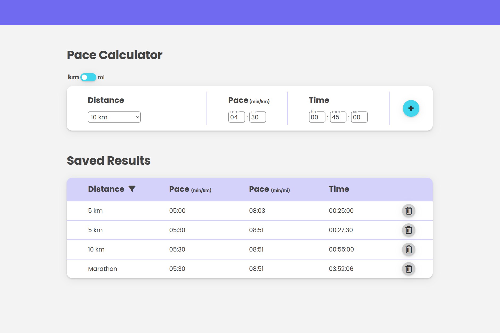

# RunWise

Welcome to RunWise! This project is a work in progress and aims to provide various useful tools for runners. Currently, it features an average speed calculator for a given distance, with plans to add more features in the future.

## Features

- 🏃‍♂️ **Average Speed Calculator**: Enter your distance and time to calculate your average speed.
- ⚡ **More features coming soon!** Stay tuned for additional tools to enhance your running experience.

## Tech Stack

- **Framework:** React
- **Language:** JavaScript
- **Package Manager:** NPM

## Installation & Setup

To run the project locally, follow these steps:

1. **Clone the repository:**

   ```sh
   git clone https://github.com/swalstab/runwise.git
   cd runwise
   ```

2. **Install dependencies:**

   ```sh
   npm install
   ```

3. **Start the development server:**
   ```sh
   npm start
   ```
   This will launch the application in your default browser.

## Screenshots


